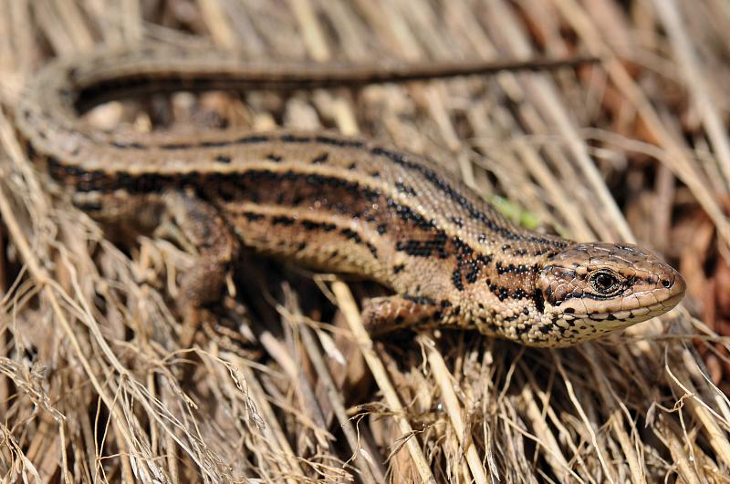
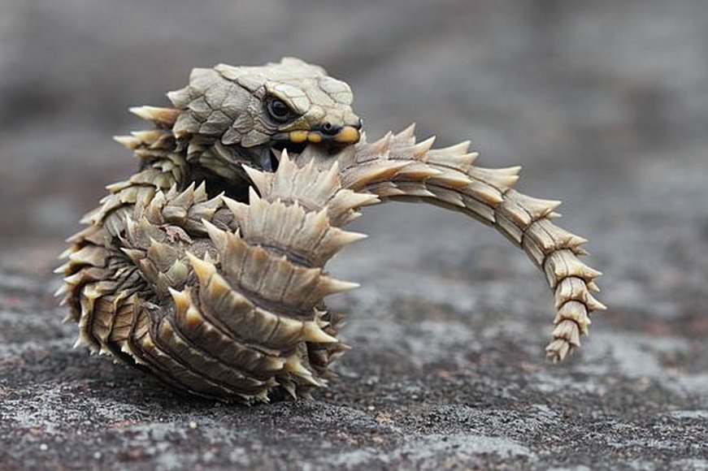

```{r setup, NOTICE USE of PACMAN, include=FALSE}
knitr::opts_chunk$set(
	echo = TRUE,
	message = FALSE,
	warning = FALSE
)
library(pacman)
pacman::p_load(gridExtra, ggplot2, maptree, party)
#pacman loads required packages, and installs ones that need installing first

library(readr)
library(tidyr)
library(dplyr)
library(rpart.plot)
library(tidyverse)


#insert data
lizcort <- read_csv("dataset_corticosterone_JAE-2018-00071.csv")

colnames(lizcort)[colnames(lizcort)=="altitude (m)"] <- "altitude"
colnames(lizcort)[colnames(lizcort)=="corticosterone (ng/ml)"] <- "cort"
colnames(lizcort)[colnames(lizcort)=="litter_mass (g)"] <- "litter_mass"
colnames(lizcort)[colnames(lizcort)=="body_mass (g)"] <- "body_mass"
glimpse(lizcort)
lizcort1 <- drop_na(lizcort, litter_mass)

```

##Reduction of baseline corticosterone secretion correlates with climate warming and drying across wild lizard populations##
Dupoué, Andréaz et al. (2019), Data from: Reduction of baseline corticosterone secretion
correlates with climate warming and drying across wild lizard populations, Dataset,
https://doi.org/10.5061/dryad.jt7vd6n



*Zootoca vivipara*, Viviparous lizard, found in Northern Europe through central Asia

What enviromental factors affect baseline CORT and what can be interpretted about the potential effects of climate change on these lizards? 

```{r fig.height=6, fig.width=15, message=FALSE, warning=FALSE}
attach(lizcort1)
model.tree1 <- cort ~ altitude + body_mass + Tmin +Tmax + litter_mass + litter_size
lizcort.tree1 <- rpart(model.tree1)
#lizcort.model <- rpart.plot(lizcort.tree1, type = 1, digits = 3, fallen.leaves = T)
plot(lizcort.tree1)
text(lizcort.tree1)

```

    
To the right: an altitude less than or equal to 1254m and a litter mass less than 0.074g has and average CORT level of 68.63 ng/ml.  A litter mass greater than 0.074g with a female body mass greater than 6.761g has an average CORT level of 33.87g. The tree continues to recycle litter mass and body mass for several more breaks.  
   
To the left: an altitude greater than 1254m with a female body mass less than or equal to 3.449g has an average CORT level of 54.37 ng/ml. The branching portion with a female body bass greater or equal to 3.449g the tree recycles the altitude variable to further break down the average CORT values by altitudes of 1313 m and 1424m. 


```{r Prune Lizard CORT tree, fig.height=6, message=FALSE, warning=FALSE}
plot(clip.rpart(rpart(model.tree1), best=5))
text(clip.rpart(rpart(model.tree1), best=5))
```


On the left side with a body mass greater or equal to 3.449g the average CORT level was 32.67, and a body mass less than 3.449g the average CORT level was 54.7 ng/ml.  

On the right, with a smaller litter mass there is was an average of 68.63 ng/ml, and with a larger litter mass, females on average had a lower average of 45.23. 

This was not what I expected to see. In many cases CORT is positively correlated with body mass, and I would have expected individuals at a higher altitude to have higher CORT levels. 

Paper found CORT levels decreased with increasing temperatures (lower altitudes) opposite of what the authors would have predicted. 


##Evolution of Body Armour in Cordyline Lizards##
Broeckhoven, Chris et al. (2018), Data from: On dangerous ground: the evolution of body armour in cordyline lizards, Dryad, Dataset, https://doi.org/10.5061/dryad.bv9247d



*Cordylus cataphractus*, Armadillo girdled lizard

Researchers were interested in the evolution of body armour in Cordylinae lizards found in southern Africa.  Researchers looked at both biotic (predation pressure) and abiotic conditions. I choose to look at the data set describing the abiotic conditions measured in respect to 27 species in the Cordylidae family. 

```{r Cordylidae Global Tree,  fig.height=8, fig.width=16, message=FALSE, warning=FALSE}
armour <- read_csv("Data environmental variables.csv")
attach(armour)
model.tree.armour <- Species ~ Annual_Mean_Temperature + Max_Temperature_Warmest_Month + Min_Temperature_Coldest_Month + Annual_Precipitation + Global_surface_vegetation_cover + Global_aridity_index +  Elevation + Global_cloud_cover +  Mean_Temperature_Warmest_Quarter + Mean_Temperature_Coldest_Quarter + Precipitation_Wettest_Month + Precipitation_Driest_Month + Direct_Normal_Irradiance  
armour.tree1 <- rpart(formula = model.tree.armour, data = armour ,  control=rpart.control(minsplit=2, minbucket=1, cp=0.001))
armour.model <- rpart.plot(armour.tree1, type = 1, digits = 3, fallen.leaves = T)
```


```{r Cordylidae Reduced Tree, fig.height=6, message=FALSE, warning=FALSE}
armour.reduced <- armour [1:5,]
model.tree.armour1 <- Species ~ Annual_Mean_Temperature + Max_Temperature_Warmest_Month + Min_Temperature_Coldest_Month + Annual_Precipitation + Global_surface_vegetation_cover + Global_aridity_index +  Elevation + Global_cloud_cover +  Mean_Temperature_Warmest_Quarter + Mean_Temperature_Coldest_Quarter + Precipitation_Wettest_Month + Precipitation_Driest_Month + Direct_Normal_Irradiance  

armour.tree2 <- rpart(formula = model.tree.armour1, data = armour.reduced ,  control=rpart.control(minsplit=2, minbucket=1, cp=0.001))

armour.model1 <- rpart.plot(armour.tree2, type = 5, digits = 3, fallen.leaves = T)
```

I choose the first 5 species listed in the data frame to observe which variables were determining the branching. 
The first branch variable occurs when the Max Temperature during the warmest month at 27.3C. 

When less than 27.3C and the Annueal Mean Temp was greater or equal to 14.4 the species *Cordylus cordylus* is predicted to have evolved armour; Annual Mean Temp was greater than 14.4C *Cordylus imkeae* is predicted to have evolved body armour. 

On the opposite side of the tree with the first branching event, *Cordylus aridus* is predicted to have evolved body armour when the Max Temp in the Warmest Month was greater or equal to 27.3 and the Annual Mean temperature was less than 16.5C.  When the Annual Mean Temp was greater or equal to 16.5C and Annual Mean Temp was great or equal to 19.3C, *Cordylus jonesii* developed body armour; less than 19.3C, *Cordylus macropholis* would develop armour. 

The authors analysis described running a PCA and finding 2 main axis one of which was correlated with several of the temperature measurements. High summer temps and arid conditions were found to have an influence and estimated predation risk was not found to have impacted the osteoderm expression. 